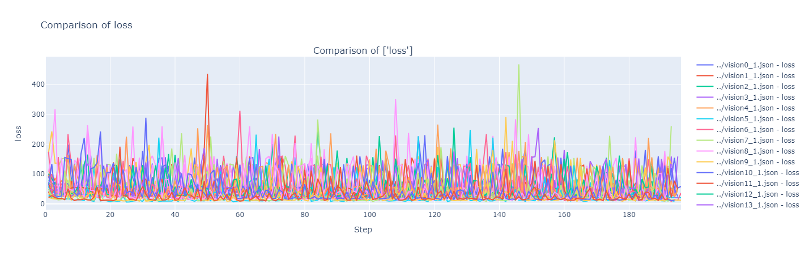
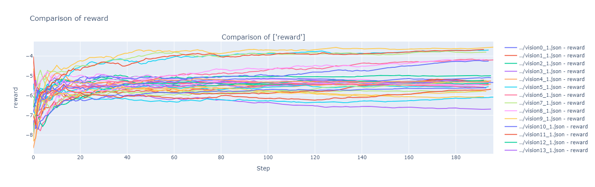
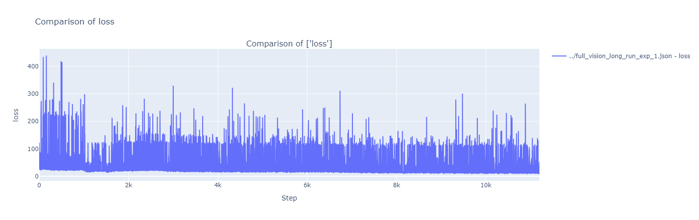
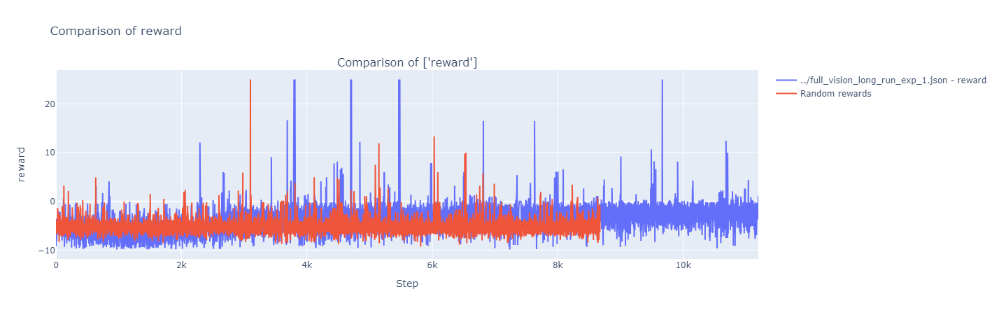

# Deep Q-Learning (DQL) Maze Solver

This repository contains an implementation of a Deep Q-Learning (DQL) model designed to solve random 10x10 mazes. The project explores reinforcement learning principles to train an agent capable of navigating mazes efficiently, overcoming challenges like walls, sub-goals, and dynamic configurations.

[DEMO](https://drive.google.com/file/d/1za4pZm7lstd2PKN1EegMrDZzxl9k8rwI/view?usp=sharing)

---

## Features

- **Random Maze Generation**: Generates 10x10 mazes with walls, sub-goals, and a final goal.
- **Deep Q-Learning Implementation**: Extends traditional Q-Learning with neural network approximations for Q-values.
- **Customizable Parameters**: Configurable hyperparameters for exploration, learning rate, and network updates.
- **Visualization and Metrics**: Real-time rendering of agent progress and detailed performance graphs.

---

## Project Overview

### Goals

1. Solve 10x10 mazes using reinforcement learning.
2. Reach a sub-goal before proceeding to the final goal.
3. Experiment with and fine-tune DQL for optimal performance.

### Environment

- **Grid**: 10x10 maze with walls enclosing navigable paths.
- **State Representation**: Agent's position (x, y) within the grid.
- **Actions**: Move up, down, left, or right.
- **Rewards**:
  - -10 for hitting a wall.
  - +50 for reaching the sub-goal.
  - +100 for reaching the final goal.
  - A penalty proportional to the distance from the goal to encourage efficiency.

---

## Architecture

### Code Structure

- `train.py`: Script to train the DQL model.
- `test.py`: Script for testing the model on new mazes.
- `environment.py`: Maze environment logic.
- `rl.py`: Reinforcement learning logic, including Q-network and replay buffer.
- `main.py`: Main entry point to customize hyperparameters and start training/testing.
- `metrics.py`: Tools for online visualization and metrics plotting.
- `fine_tuning.ipynb`: Notebook for comparing models and tuning hyperparameters.

### DQL Implementation

- **Neural Network**: Approximates Q-values for action-value mapping.
- **Replay Buffer**: Stores past experiences for efficient batch training.
- **Epsilon-Greedy Policy**: Balances exploration and exploitation with decaying epsilon.
- **Soft Updates**: Stabilizes learning by gradually updating target networks.

---

## Results

### Training Insights

1. **Fine-Tuning Parameters**: The following hyperparameters were fine-tuned for best performance:
   - Learning Rate (`alpha`): 0.001
   - Target Network Update Factor (`tau`): 0.005
   - Steps per Update: 10

2. **Performance Metrics**:
   - Loss convergence trends and reward accumulation over episodes.
   - Filtering top-performing configurations based on reward metrics.

  
*Figure 2: Loss convergence during tuning.*

  
*Figure 3: Rewards during tuning.*

  
*Figure 4: Loss convergence during tuning.*

  
*Figure 5: Rewards during training.*

### Challenges and Limitations

- **Performance**: While the model avoids walls and finds goals occasionally, it underperforms compared to human-level navigation.
- **Training Time**: 10,000 episodes took approximately 5 hours due to computational complexity.
- **Unfinished Extensions**: Plans for adversarial agents and obstacle avoidance remain unimplemented.

---

## Getting Started

### Prerequisites

- Python 3.7+
- Required libraries (install via pip):
  ```bash
  pip install -r requirements.txt
